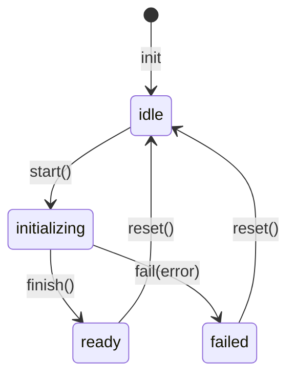

# Диаграмма: bootstrap-flow

Sequence-диаграмма потока загрузки приложения. Объяснение — [../architecture.md § Bootstrap-поток](../architecture.md).

## Ключевое свойство

UI монтируется **до** окончания асинхронной инициализации. Это даёт пользователю мгновенную обратную связь (splash-экран) даже на медленном backend.

## Диаграмма

```mermaid
sequenceDiagram
    autonumber
    actor Browser
    participant main as main.ts
    participant App as App.vue
    participant Preloader as AppPreloader
    participant Providers as setupProviders
    participant Bootstrap as bootstrap.store
    participant Process as runBootstrapProcess
    participant Router as vue-router

    Browser->>main: загрузка bundle
    main->>main: createApp(App)
    main->>Providers: setupProviders(app)
    Providers->>Providers: createPinia + createVuetify + createRouter
    Providers-->>main: { router, pinia, vuetify }

    main->>App: app.mount('#app')
    App->>Bootstrap: useBootstrapStore()
    Note over Bootstrap: status = 'idle'<br/>isReady = false
    App->>Preloader: v-else → <AppPreloader/>
    Preloader-->>Browser: SVG-анимация на экране

    main->>Process: await runBootstrapProcess({ router })
    Process->>Bootstrap: start()
    Note over Bootstrap: status = 'initializing'

    Process->>Process: auth.init()
    Note right of Process: чтение токенов из tokenStorage<br/>в state стора auth (sync)

    alt isSessionActive
        Process->>Process: await user.fetchCurrentUser()
        Note right of Process: тянет профиль; внутри ловит<br/>ошибки и обнуляет user
    end

    Process->>Router: await isReady()
    Router-->>Process: ✓

    Note right of Process: env-валидация (Zod) и session-refresh<br/>при 401 — ROADMAP, Фаза 1

    alt success
        Process->>Bootstrap: finish()
        Note over Bootstrap: status = 'ready'<br/>isReady = true
        App->>App: v-if переключается на <v-app>
        App-->>Browser: <router-view/> рендерится
    else error
        Process->>Bootstrap: fail(error)
        Note over Bootstrap: status = 'failed'<br/>hasError = true
        Process-->>main: throw
        Note over main: ⚠ обработка ошибки<br/>пока не реализована<br/>(ROADMAP, Фаза 1)
    end
```

## Состояния `useBootstrapStore`



Реализация — [src/entities/bootstrap/bootstrap.store.ts](../../src/entities/bootstrap/bootstrap.store.ts).

## Точки расширения

Текущий порядок шагов внутри `runBootstrapProcess`:

1. **Init auth** — `auth.init()`: sync-чтение токенов из `tokenStorage` в state стора. **Реализовано.**
2. **Fetch current user** — `user.fetchCurrentUser()` если `auth.isSessionActive`. **Реализовано.**
3. **`router.isReady()`** — последний шаг, после него `App.vue` переключается в `<v-app>`. **Реализовано.**

Запланированные расширения ([ROADMAP](../../ROADMAP.md)):

- **Валидация env** — `envSchema.parse(import.meta.env)`, падать с понятной ошибкой на старте (Фаза 1).
- **Session-refresh при 401** — interceptor HTTP-клиента + попытка `refresh` (Фаза 1).
- **Prefetch критичных справочников** — добавлять по необходимости, осторожно: всё, что блокирует splash, тормозит первый рендер.

## Анти-паттерны

| ❌ | Почему плохо |
|---|--------------|
| `app.mount('#app')` после `runBootstrapProcess()` | UI висит без обратной связи пока идёт init |
| `auth.init()` в `setupRouter()` напрямую | Смешивание оркестрации с конфигурацией провайдеров |
| Long-running fetch'и в bootstrap | Splash висит, пользователь думает, что зависло. Лениво подгружай в конкретных страницах |
| Зависимость `entities/bootstrap` от других сущностей | `bootstrap` — FSM, должен быть «глупым». Оркестрация — в `processes/` |

## См. также

- [../architecture.md](../architecture.md) — общая архитектура
- [src/processes/app-bootstrap/bootstrap.process.ts](../../src/processes/app-bootstrap/bootstrap.process.ts) — текущая реализация
- [src/entities/bootstrap/bootstrap.store.ts](../../src/entities/bootstrap/bootstrap.store.ts) — FSM-стор
