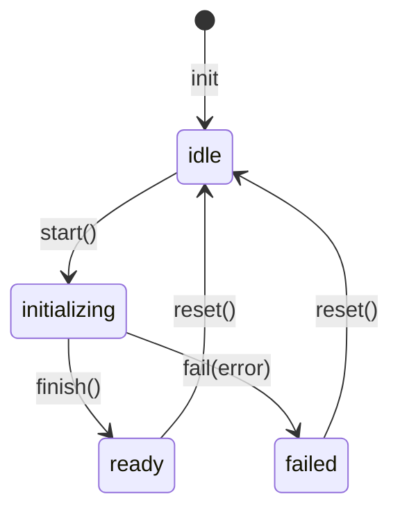

# Диаграмма: bootstrap-flow

Sequence-диаграмма потока загрузки приложения. Объяснение — [../architecture.md § Bootstrap-поток](../architecture.md).

## Ключевое свойство

UI монтируется **до** окончания асинхронной инициализации. Это даёт пользователю мгновенную обратную связь (splash-экран) даже на медленном backend.

Плата за это свойство: первая навигация стартует синхронно внутри `app.use(router)`, то есть **раньше** bootstrap. Поэтому auth-guard ждёт `whenSessionRestored()` — иначе он судит по пустому user-стору. Подробности и инварианты — [ADR-0016](../adr/0016-failure-classification-and-bootstrap-outcomes.md).

## Диаграмма

```mermaid
sequenceDiagram
    autonumber
    actor Browser
    participant main as main.ts
    participant App as App.vue
    participant Preloader as AppPreloader
    participant Providers as setupProviders
    participant Bootstrap as bootstrap.store
    participant Process as runBootstrapProcess
    participant Router as vue-router

    Browser->>main: загрузка bundle
    main->>main: createApp(App)
    main->>Providers: setupProviders(app)
    Providers->>Providers: pinia + httpClient + errorHandler<br/>+ theme + query
    Providers->>Router: setupRouter(app, { waitForSession })
    Router->>Router: app.use(router) → старт первой навигации (sync)
    Router->>Process: beforeEach: await whenSessionRestored()
    Note over Router: guard ЗАБЛОКИРОВАН: user-стор ещё пуст,<br/>решение по нему увело бы на login при F5
    Providers-->>main: { pinia, httpClient, router }

    main->>App: app.mount('#app')
    App->>Bootstrap: useBootstrapStore()
    Note over Bootstrap: status = 'idle'<br/>isReady = false
    App->>Preloader: v-else → <AppPreloader/>
    Preloader-->>Browser: SVG-анимация на экране

    main->>Process: await runBootstrapProcess({ router })
    Process->>Bootstrap: start()
    Note over Bootstrap: status = 'initializing'

    Process->>Process: auth.init()
    Note right of Process: чтение токенов из tokenStorage<br/>в state стора auth (sync)

    alt isSessionActive
        Process->>Process: restoreSession(): retryOn404(() => user.fetchCurrentUser(),<br/>{ attempts: 3, delay: 500 })
        Note right of Process: тянет профиль через GET /users/me;<br/>retry на 404 покрывает гонку с<br/>UserSignedInEvent на njs-server.<br/>Сверху — 2 тихих повтора (0.5s, 2s)<br/>на retryable-отказы
    end

    Note right of Process: env уже валидирован (Zod) при импорте<br/>shared/config/env. 401 + refresh — внутри HTTP-клиента.

    alt успех, нет сессии или 401 (сессия истекла)
        Process->>Router: whenSessionRestored() → resolve
        Note over Router: guard разблокирован и принимает<br/>решение по актуальному user-стору
        Process->>Router: await isReady()
        Router-->>Process: ✓
        Process->>Bootstrap: finish()
        Note over Bootstrap: status = 'ready'
        App->>App: v-if переключается на <router-view/>
        App-->>Browser: layout (default или auth) рендерится
    else retryable (offline / network / timeout / 5xx)
        Process->>Bootstrap: fail(error) → retryable = true
        Note over Router: guard НАМЕРЕННО остаётся заблокированным:<br/>успешный повтор должен решать<br/>по восстановленному состоянию
        App-->>Browser: AppBootstrapError: авто-повтор 10/30/60s,<br/>мгновенный по событию online
    else fatal (contract / unknown)
        Process->>Bootstrap: fail(error) → retryable = false
        Process->>Router: whenSessionRestored() → resolve
        App-->>Browser: AppBootstrapError без кнопки «Повторить»
    end
```

`runBootstrapProcess` **не пробрасывает** отказ наружу: экран ошибки рисуется по состоянию стора. Раньше был `throw` в расчёте на глобальный error-handler, но снекбар живёт внутри layout'а, то есть внутри `<router-view>`, которого при `!isReady` нет — ошибку было нечем показать.

## Состояния `useBootstrapStore`



Реализация — [src/entities/bootstrap/bootstrap.store.ts](../../src/entities/bootstrap/bootstrap.store.ts).

## Точки расширения

Текущий порядок шагов внутри `runBootstrapProcess`:

1. **Init auth** — `auth.init()`: sync-чтение токенов из `tokenStorage` в state стора. **Реализовано.**
2. **Fetch current user** — `user.fetchCurrentUser()` если `auth.isSessionActive`, обёрнут в `retryOn404` (`@/shared/lib/async`) для гонки с `UserSignedInEvent` бэка, а сверху — тихие повторы на retryable-отказы. **Реализовано.**
3. **Разблокировка guard'а** — `whenSessionRestored()` резолвится. Строго **до** шага 4: guard ждёт этот сигнал, а `isReady()` ждёт завершения навигации, то есть guard'а. Совместить их в одно событие — дедлок. **Реализовано.**
4. **`router.isReady()`** — после него `App.vue` рендерит `<router-view/>` через layout. **Реализовано.**

Уже встроено в инфраструктуру (вне bootstrap):

- **Env-валидация** — `shared/config/env.ts` парсит `import.meta.env` через Zod при первом импорте; не нужно вызывать из bootstrap.
- **Session-refresh при 401** — внутри `HttpClient` (single-flight `refreshPromise`), зовётся через `onUnauthorized` коллбэк из `setup-http-client.ts`.

Запланированные расширения ([ROADMAP](../../ROADMAP.md), Фаза 2):

- **Prefetch критичных справочников** — добавлять по необходимости, осторожно: всё, что блокирует splash, тормозит первый рендер.

## Анти-паттерны

| ❌ | Почему плохо |
|---|--------------|
| `app.mount('#app')` после `runBootstrapProcess()` | UI висит без обратной связи пока идёт init |
| `auth.init()` в `setupRouter()` напрямую | Смешивание оркестрации с конфигурацией провайдеров |
| Long-running fetch'и в bootstrap | Splash висит, пользователь думает, что зависло. Лениво подгружай в конкретных страницах |
| Зависимость `entities/bootstrap` от других сущностей | `bootstrap` — FSM, должен быть «глупым». Оркестрация — в `processes/` |
| Резолвить `whenSessionRestored()` после `router.isReady()` | Дедлок: guard ждёт сигнал, `isReady()` ждёт guard |
| Резолвить его при retryable-отказе | Успешный повтор не перезапустит guard — пользователь останется на логине при живой сессии |
| Импортировать `whenSessionRestored` в `setupRouter` напрямую вместо DI | Тесты и Storybook, где bootstrap не запускается, зависнут на вечном промисе |
| Показывать ошибку старта через notification-store | Snackbar рендерится внутри layout'а, то есть внутри `<router-view>` — при `!isReady` его нет |

## См. также

- [../architecture.md](../architecture.md) — общая архитектура
- [src/processes/app-bootstrap/bootstrap.process.ts](../../src/processes/app-bootstrap/bootstrap.process.ts) — текущая реализация
- [src/entities/bootstrap/bootstrap.store.ts](../../src/entities/bootstrap/bootstrap.store.ts) — FSM-стор
