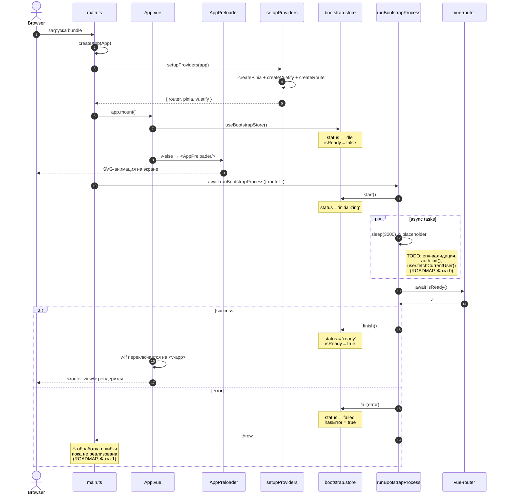
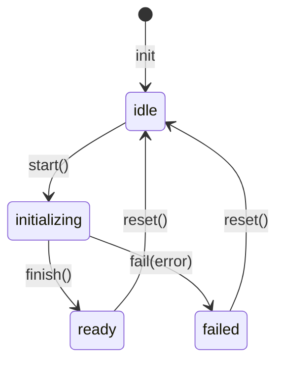

# Диаграмма: bootstrap-flow

Sequence-диаграмма потока загрузки приложения. Объяснение — [../architecture.md § Bootstrap-поток](../architecture.md).

## Ключевое свойство

UI монтируется **до** окончания асинхронной инициализации. Это даёт пользователю мгновенную обратную связь (splash-экран) даже на медленном backend.

## Диаграмма

## Состояния `useBootstrapStore`

Реализация — [src/entities/bootstrap/bootstrap.store.ts](../../src/entities/bootstrap/bootstrap.store.ts).

## Точки расширения

В порядке выполнения внутри `runBootstrapProcess` будут добавляться шаги:

1. **Валидация env** — `envSchema.parse(import.meta.env)` ([ROADMAP](../../ROADMAP.md), Фаза 1). Падать с понятной ошибкой, если переменные отсутствуют.
2. **Init auth** — `auth.init()`: чтение токена из storage, попытка `refresh` если истёк ([ROADMAP](../../ROADMAP.md), Фаза 0).
3. **Fetch current user** — `user.fetchCurrentUser()` если есть валидный токен.
4. **Prefetch критичных справочников** — справочники, без которых не работает UI (роли, типы и т.п.). Только то, что **действительно** нужно сразу — остальное лениво.
5. **`router.isReady()`** — последний шаг, после него можно переключать `App.vue` в `<v-app>`.

## Анти-паттерны

| ❌ | Почему плохо |
|---|--------------|
| `app.mount('#app')` после `runBootstrapProcess()` | UI висит без обратной связи пока идёт init |
| `auth.init()` в `setupRouter()` напрямую | Смешивание оркестрации с конфигурацией провайдеров |
| Long-running fetch'и в bootstrap | Splash висит, пользователь думает, что зависло. Лениво подгружай в конкретных страницах |
| Зависимость `entities/bootstrap` от других сущностей | `bootstrap` — FSM, должен быть «глупым». Оркестрация — в `processes/` |

## См. также

- [../architecture.md](../architecture.md) — общая архитектура
- [src/processes/app-bootstrap/bootstrap.process.ts](../../src/processes/app-bootstrap/bootstrap.process.ts) — текущая реализация
- [src/entities/bootstrap/bootstrap.store.ts](../../src/entities/bootstrap/bootstrap.store.ts) — FSM-стор
